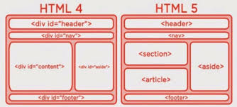

# Etiquetar estructurales

## Elementos de diseño HTML en detalle

 las definiciones principales que deberíamos tratar de entender:

1. ## < header >
representa un grupo de contenido introductorio. Si este es «hijo» de un elemento < body >, se convertirá en el encabezado principal del sitio web, pero si es hijo de un elemento < article > o un elemento < section >, entonces simplemente será el encabezado particular de cada sección (por favor, no lo confundas con títulos y encabezados).

2. ## < nav > 
contiene la funcionalidad de navegación principal de la página. Los enlaces secundarios, etc., no entrarán en la navegación.

3. ## < main >

encierra el contenido particular a esta página. Utilizaremos **< main >** solamente una vez para cada página y lo situaremos directamente dentro del elemento < body >. Es mejor que no lo anidemos en otros elementos.

4. ## < section >

es parecido al elemento < article >, pero se usa más para agrupar cada parte de la página que, por su funcionalidad, constituye una sección en sí misma (por ejemplo un minimapa o un conjunto de titulares y resúmenes). Se considera una buena práctica comenzar cada una de estas secciones con un título de encabezado (heading); observa que podemos subdividir artículos (< article >) en distintas secciones (< section >), o también secciones en distintos artículos, dependiendo del contexto.

5. ## < article >

encuadra un bloque de contenido que tiene sentido por sí mismo aparte del resto de la página.
 Podría ser un mensaje en un foro, un artículo de una revista o un periódico, una entrada de blog, un comentario de un usuario, un widget interactivo o gadget, o cualquier otro elemento independiente del contenido.

 #### EJEMPLO

```html
<article>
<header>
	<h1>All About Flour<h1>
	<p class="byline">by Jane Doe</p>
</header>
<section>
	<h2>The Two Types of Wheat</h2>
	<p>There … to rise.</p>
	<p>Where … with less protein.</p>
</section>
<blockquote>
	Wholemeal flour, the whole grain milled as finely as possible with all of the outer bran and inner germ intact, is one of the best white flour improvers I know of. <br />
	<address>Dan Lepard, www.danlepard.com</address>
</blockquote>
</article>
```

#### Etiqueta addres

El elemento HTML `<address>` aporta información de contacto para su `<article>` más cercano o ancestro `<body>` ; en el último caso lo aplica a todo el documento.
Este elemento no debe contener más información que la información de contacto.
Para representar una dirección arbitraria, una que no esté relacionada con la información de contacto, utiliza un elemento `<p>` en lugar del elemento `<address>`.

Ejemplo

```html
<footer>
 <address>
  For more details, contact
  <a href="mailto:js@example.com">John Smith</a>.
 </address>
 <p><small>© copyright 2038 Example Corp.</small></p>
</footer>
```

6. ## < aside >

Incluye contenido que no está directamente relacionado con el contenido principal, pero que puede aportar información adicional relacionada indirectamente con él (resúmenes, biografías del autor, enlaces relacionados, etc.).

7. ## < footer >

representa un grupo de contenido al final de una página.


### Ejemplos




