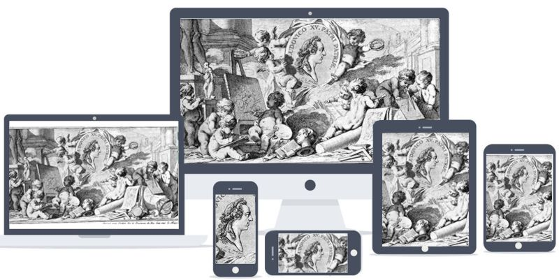

# imagenes

## etiqueta

< img > No debe llevar etiqueta de cierre.

Al ser un elemento vacio no puede tener nodos secundario es decir, no puede ir anidado.
En caso de tener cierre es una etiqueta de html no válida.

## Atributos

+ ### alt 

Este atributo define el texto alternativo que describe la imagen, texto que los usuarios verán si la URL de la imagen es errónea o la imagen tiene un formato no soportado o si la imagen aún no se ha descargado.

+ ### longdesc ( no se usa)

especifica un hipervínculo a una descripción detallada de una imagen.
2022 casi no tiene soporte para todos los navegadores.

+ ### crossorigin

Las páginas web a menudo realizan solicitudes para cargar recursos en otros servidores. Aquí es donde entra CORS. Una solicitud de origen cruzado es una solicitud de un recurso (por ejemplo, hojas de estilo, iframes, imágenes, fuentes o scripts) de otro dominio.
CORS significa Cross-Origin Resource Sharing, y es un mecanismo que permite que los recursos de una página web se soliciten desde otro dominio fuera de su propio dominio. Define una forma de cómo un navegador y un servidor pueden interactuar para determinar si es seguro permitir la solicitud de origen cruzado.
Lo opuesto a las solicitudes de origen cruzado son las solicitudes del mismo origen
Esto significa que una página web solo puede interactuar con otros documentos que también están en el mismo servidor. 
El estándar de Intercambio de Recursos de Origen Cruzado trabaja añadiendo nuevas cabeceras HTTP que permiten a los servidores describir el conjunto de orígenes que tienen permiso para leer la información usando un explorador web.     

#### **Valores posibles :**

##### **anonymous :**
 
una solicitudes de este elemento no tendrán establecido el indicador de credenciales.

##### **use-credentials :**

CORS, las solicitudes de este elemento tendrán marcado el indicador de credenciales; esto significa que la solicitud proporcionará credenciales.
Sí el servidor no emite credenciales al sitio de origen (a través del Access-Control-Allow-Credentials: HTTP header), la imagen será pintada y su uso restringido.

##### **Por defecto**

Con el atributo no es específicado, CORS no se usa.

+ ### height o width

Altura/ancho en pixeles  html5
altura/ancho en porcentaje html4

+ ### src

La URL de la imagen. Este atributo es obligatorio para el elemento < img >. 
En navegadores que soportan srcset, src es tratado como imagen candidata con una densidad del píxel 1x.

+ ### srcset (HTML5)

lista de una o más cadenas separadas por comas indicando las posibles fuentes para usar. Cada cadena está compuesta por:
+ URL de la imagen
+ Opcionalmente, espacios en blanco seguidos de:
    + Un ancho, que es un entero positivo seguido directamente por 'w'.   El ancho está dividido por el tamaño de la fuente dada en el atributo sizes para calcular la densidad del píxel.
    + Densidad del píxel, un positivo decimal seguido directamente de 'x'.

**srcset** define el conjunto de imágenes que el navegador podrá elegir, y el tamaño de cada imagen. 

Ejemplo dondse se selecciona la imagen segun su DPI.

```html


```
Se indican las rutas a tres imágenes. A continuación cada ruta (separado por un espacio en blanco y antes de la coma que las separa) se indica un valor Nx que es la referencia para que el navegador seleccione la que mejor se ajuste a la densidad de píxeles (DPI) del dispositivo que la mostrará.
Si no hay descriptores especificados,(primera imagen) la fuente es asignada por defecto a 1x.
En este caso, los distintos archivos de imagen pueden ofrecer o no la misma visión. Lo que sí es que cada archivo está guardado en una resolución diferente.

Ejemplo dondse se selecciona la imagen segun su tamaño.

```html

```
El navegador mostrará una de las imágenes indicadas en el srcset en función del tamaño de la ventana .


**Es inválido mezclar ancho y densidad del píxel en el mismo atributo srcset. Descriptores duplicados (por ejemplo, dos fuentes en el mismo srcset definidos ambos con '2x') son inválidos, también.**

+ ### sizes

Define un conjunto de condiciones de medios (por ejemplo, anchos de pantalla) e indica qué tamaño de imagen sería mejor elegir cuando se cumplen ciertas condiciones de medios
Cada tamaño de la fuente consiste en:
+ Codición de medios. Debe omitirse en el último ítem.
+ Valor del tamaño.

Si no hay atributo srcset, o no contiene valores con el ancho definido, entonces el atributo sizes no funciona.

Sizes admite un valor sizes='100vw' o múltiples valores separados por comas.
Los valores admitidos como válidos son cualquiera de los usados en tamaños (px, rem, unidades relativas al viewport) e incluso @medias queries: sizes="(max-width: 30em) 100vw, (max-width: 50em) 50vw, calc(33vw - 100px)"

```html


```
Con este código, en ventanas de 800px o mayores la imagen se muestra ocupando el 60% de la anchura de la ventana y en menores el 100%.Y en base a ello el navegador mostrará una de las imágenes indicadas en el srcset en función del tamaño de la ventana y de la densidad de píxeles de la pantalla.

También se puede indicar archivo de imagen por tamaño de ventana de la siguiente forma con el elemento source y el atributo media:
    
```html
<picture>
    <source media='(min-width: 45rem)' srcset='large.jpg'>
    <source media='(min-width: 18rem)' srcset='medium.jpg'>
    
</picture>
```


##### Seleccion de la imagen por formato de archivo

```html
<picture>
  <source src="imagen.avif" type="image/avif" srcset="imagen.avif">
  <source src="imagen.webp" type="image/webp" srcset="imagen.webp">
  
</picture>    
```
segun si los navegadores soportan o no iran comprobando en orden desendente.
El atributo type permite especificar un tipo MIME para los recursos


#### Seleccion por criterios Artisticos

ebido a la disparidad que hay en la relación de aspectos de pantallas, hay imágenes que por su composición artístisca perderían la información relevante si sólo se escalasen en su tamaño para ajustarse al tamaño de las pantallas o su densidad de px.
utlizando criterios artísticos en vez de basarnos en el tamaño del viewport el resultado será mucho más satisfactorio:



Tengamos dos recortes distintos de una fotografía, uno en vertical y otro en horizontal, para ser mostrado en función de la orientación del dispositivo (landscape o portrait):

```html
<picture>
  <source media="(orientation: landscape)" srcset="art-landscape.jpg">
  <source media="(orientation: portrait)" srcset="art-portrait.jpg">
  
</picture>
```
Recuerda que como valor del atributo media se puede utilizar cualquiera de los admitidos por las @medias queries de Css.


PAGINA DONDE SE SACO LA INFO FINAL

[blogspot](https://escss.blogspot.com/2014/10/responsive-images-picture-srcset.html)

## Etiqueta < picture >

es un contenedor usado para especificar múltiples elementos < source > y un elemento < img > contenido en él para proveer versiones de una imagen para diferentes escenarios de dispositivos. Si no hay coincidencias con los elementos < source >, el archivo especificado en los atributos src del elemento < img > es utilizado. La imagen seleccionada es entonces presentada en el espacio ocupado por el elemento < img >.
Para seleccionar la imagen óptima, el user agent (en-US) examina cada atributo srcset, media, y type de la fuente para seleccionar la imagen compatible.

PARA UN AJUSTE MAS FINO...

Se puede usar la propiedad object-position para ajustar la posición de la imagen dentro del marco del elemento, y la propiedad object-fit para controlar como el tamaño de la imagen se ajusta para adaptarse al marco.
