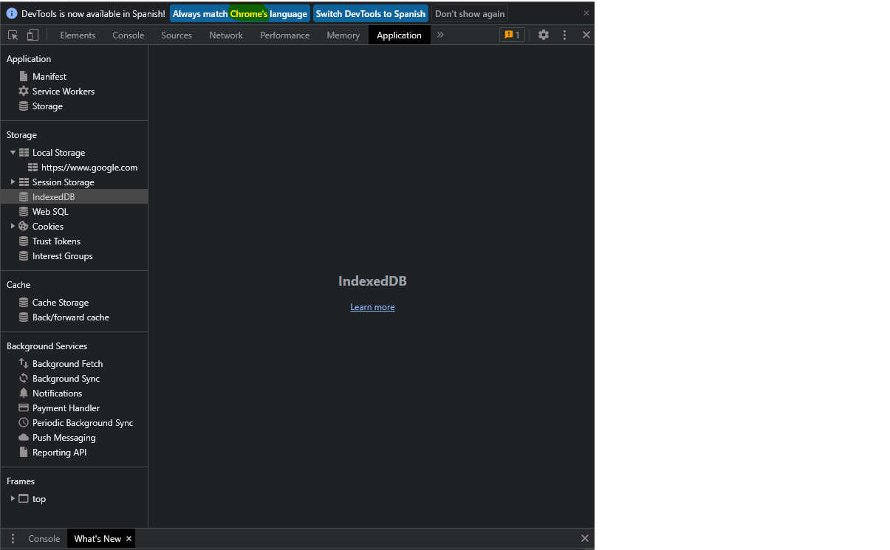
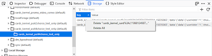

# IndexedDB (API JS)

Es una **base de datos** integrada en un navegador, mucho más potente que localStorage.

+  Almacena casi cualquier tipo de valores por claves
+ Admite transacciones para mayor confiabilidad.
+ Admite consultas de rango clave, índices.
+ Puede almacenar volúmenes de datos mucho mayores que localStorage. Para archivos de mas de 50 Mb va a preguntar pro permisos.

Ese poder suele ser excesivo para las aplicaciones tradicionales de cliente-servidor. IndexedDB está diseñado para aplicaciones fuera de línea, para combinarse con ServiceWorkers y otras tecnologías.

    Técnicamente, los datos generalmente se almacenan en el directorio de inicio del visitante, junto con la configuración del navegador, extensiones, etc.
    Los diferentes navegadores y usuarios de nivel de sistema operativo tienen cada uno su propio almacenamiento independiente.

## Funcionamiento

 Las bases de datos se estructuran en base a almacenes de objetos que permiten guardar diversos formatos: cadenas (strings), cifras, objetos, fechas y matrices (arrays).

IndexedDB no es una base de datos relacional, sino un sistema tabular basado en índices. De hecho, se trata de una base de datos NoSQL, como también lo es por ejemplo MongoDB. Los registros siempre se definen en pares de clave y valor, en los que el valor constituye un objeto y la clave, la característica del mismo. A esto se le añaden los índices, que permiten buscar rápidamente los datos.

En IndexedDB, las operaciones siempre se realizan en forma de transacciones: cada procedimiento de escritura, lectura o modificación se integra en una transacción, lo que garantiza que los cambios en la base de datos se realicen completamente o no se realicen en absoluto. Una ventaja de IndexedDB es que no requiere una transmisión síncrona de los datos (en la mayoría de los casos), sino que las operaciones son asíncronas, lo que garantiza que el navegador web no se bloquee durante el envío de datos y que el usuario pueda continuar utilizándolo.

## Acceso desde Chrome

## Acceso desde Firefox

